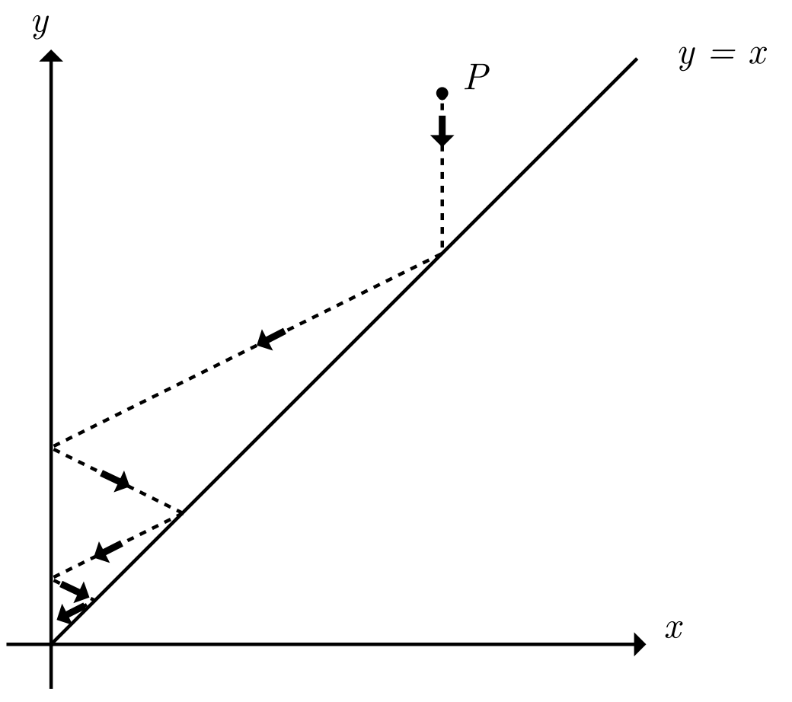
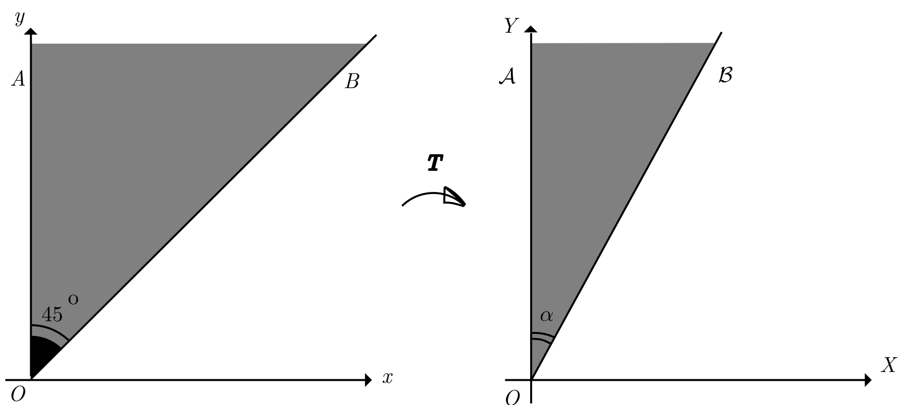
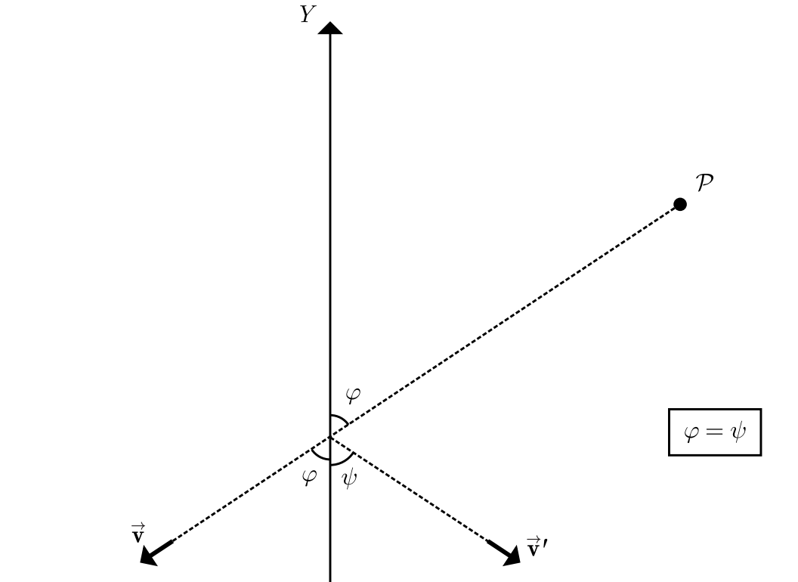

# modmat-billard-pi-problem

<!-- SLIDE 1 -->
## Jogando Sinuca com $\pi$ 

### Como o número de colisões em um sistema mecânico computa os digitos de $\pi$

Leonardo Lima Santos, Lucas Pimentel Alves da Costa, Pedro Kury Kitagawa

<!-- SLIDE 2 -->
## Definição do Problema

### Objetivo: Calcular a quantidade de colisões em um sistema idealizado

- Sistema Físico
    - Parede fixa em $x = 0$
    - Duas bolas de massa $m$ (pequena) e $M$ (grande)
    - Movimento ocorre de forma unidimensional (eixo $X$)
    - A bola $m$ é posicionada em repouso entre a parede e a bola $M$
    - A bola $M$ inicialmente possui velocidade V em direção à bola $m$

<!-- SLIDE 3 -->

## Variáveis e Suposições do Sistema

- Variáveis fundamentais
    - Massa das duas bolas $m$ e $M$
    - A razão entre as massas $\frac{M}{m} = 100^N$. Sendo $N$ o número de digitos de $\pi$ que vamos computar (veremos adiante o porque são 100)

- Simplificações e Variáveis Desprezadas:
    - Colisões perfeitamente elásticas
    - Ausência de atrito e resistência do ar
    - Bolas são partículas adimensionais

<!-- SLIDE 4 -->

## O que realmente acontece nas colisões?

### Análise do caso simples $m = M$

$$
\begin{aligned}
u_0 & = 0 \\
v_0 & = V \\
u_1 & = \frac{(m - M)u_0 + 2Mv_0}{m + M} \\
v_1 & = \frac{(M - m)v_0 + 2mu_0}{m + M} \\
u_1 & = \frac{2MV}{2M} = V \\
v_1 & = \frac {(0)V}{2m}= 0\\
\end{aligned}
$$

1. A bola $M$ bate com velocidade $V$ na bola $m$ e fica em repouso (primeira colisão)
2. A bola $m$ segue até a parede, bate na parede com velocidade $V$ e volta com velocidade $-V$ (segunda colisão)
3. A bola $m$ bate com velocidade $-V$ na bola $M$ e fica em repouso (terceira colisão)
4. A bola $M$ segue indefinidamente com velocidade $-V$

## Modelagem Matemática (e computacional)

<!-- SLIDE 5 -->

### O espaço de configuração do sistema

- Posição de $m$ como $x(t)$ e $M$ como $y(t)$
- $P(t) = (x(t), y(t))$
- Bola $m$ entre a parede e a bola $M$, significa que $0 \leq x(t) \leq y(t)$
- Colisões
    - Colisões:
        - Bola-Parede
            - $x(t) = 0$ reflexão simples do ponto $P$ no eixo $Y$
        - Bola-Bola
            - $x(t) = y(t)$: reflexão complexa do ponto $P$ na fronteira $x = y$. Não é uma simples reflexão óptica. 

<!-- SLIDE 6 -->
### Início do experimento
$p = (x(t),y(t))$ e $\dot p = (\dot x(t),\dot y(t))$ 

<!-- SLIDE 7 -->
### Primeira colisão entre $m$ e $M$
$\dot p(0) = (0,V) \vdash p(t_1) = (V,0)$

<!-- SLIDE 8 -->
### Colisão entre $m$ e a parede
$\dot p(t_1) = (V,0) \vdash \dot p(t_2) = (-V,0)$

<!-- SLIDE 9 -->
### Segunda colisão entre $m$ e $M$
$\dot p(t_2) = (-V,0) \vdash \dot p(t_3) = (0,-V)$

<!-- SLIDE 10 -->
### $M$ segue infinitamente, com $m$ parado.
$\dot p(t_{\infty}) = (0,-V)$

<!-- SLIDE 11 -->
### O que acontece quando $m \neq M$?
- As reflexões não são mais perfeitas.
- Não sabemos se eventualmente o ponto P volta (ou seja, se as colisões param)

<!-- SLIDE 12 -->

## O pulo do gato

### A chave para simplificar o problema

- Tornar a reflexão na fronteira $x = y$ simples

Definimos novas coordenadas $(x', y')$

$$x' = \sqrt{m} \cdot x$$

$$y' = \sqrt{M} \cdot y$$

$$\vec{p} = \begin{pmatrix} x \\ y \end{pmatrix}$$

$$\vec{p'} = \begin{pmatrix} x' \\ y' \end{pmatrix}$$ 

A transformação é uma operação linear que nos leva de $\vec{p}$ para $\vec{p'}$, e por isso pode ser representada por uma matriz de transformação $T$, tal que:
$$\vec{p'} = T \cdot \vec{p}$$

$$T = \begin{pmatrix} \sqrt{m} & 0 \\ 0 & \sqrt{M} \end{pmatrix}$$

Então

$$\vec{p'} = \begin{pmatrix} \sqrt{m} x \\ \sqrt{M} y \end{pmatrix}$$ 

<!-- SLIDE 13 -->
### Novo espaço após aplicação de $T$
Como vamos aplicar a transformação $T$ no espaço inteiro, então o ângulo entre o eixo $X$ e a reta $x=y$ muda.

<!-- SLIDE 14 -->
### Poque aplicamos $T$?

- Nosso objetivo é fazer com que as reflexões sejam reflexões perfeitas
- Depois que nossas reflexões forem perfeitas, basta refletirmos todo o espaço abaixo do eixo para saber aonde a configuração (nosso ponto $p$) vai parar.

- Precisamos, então, provar que a transformação faz com que as reflexões de $p$ sejam perfeitas.

- Se, em qualquer momento que não seja uma reflexão, $\vec{p}$ tem velocidade $\vec{\dot p}= \begin{pmatrix}u \\ v\end{pmatrix}$, então a velocidade de $\vec{p'}$ é $\vec{\dot p'} = \begin{pmatrix} \sqrt{m} \dot x \\ \sqrt{M} \dot y \end{pmatrix} = \begin{pmatrix} \sqrt{m} u \\ \sqrt{M} v \end{pmatrix}$. Então $T$ transforma as velocidades da mesma forma que transforma as posições.

- Vamos analisar o caso em que ocorre a reflexão na parede ($x(t)=0$), e o caso onde ocorre a reflexão no eixo $Y = \sqrt{\frac{M}{m}}X$.

<!-- SLIDE 15 --->
### Reflexão no eixo $Y$

- Quando a bola menor reflete na parede, sua velocidade $u$ passa a ser $(-u)$.
Dessa forma $\vec{\dot p'} = \begin{pmatrix} \sqrt{m}(-u) \\ \sqrt{M}v \end{pmatrix} = \begin{pmatrix} -\sqrt{m}u \\ \sqrt{M}v \end{pmatrix}$

- Isso só acontece quando o ângulo $\varphi$ que a trajetória faz antes de atingir o eixo $Y$ faz com o eixo $Y$ é igual ao ângulo $\psi$ que a trajetória faz depois de atingir o eixo $Y$ com o eixo $Y$.

- Então essa reflexão é perfeita. 

$\blacksquare 1/2$

<!-- SLIDE 16 --->
### Reflexão no eixo $Y = \sqrt{\frac{M}{m}}X$

- Lembrando: $u$ é a velocidade da bola $m$ e $v$ a velocidade da bola $M$.
- Quando há a colisão entre $m$ e $M$, temos:
$
\begin{aligned}
\begin{cases}
      mu + Mv &= K_1 \\ 
      mu^2 + Mv^2 &= K_2 
\end{cases}
\end{aligned}
$
com $K_1,K_2$ constantes.

## 