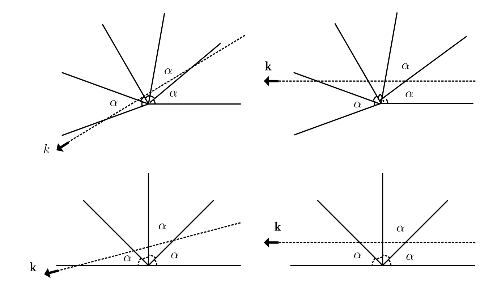
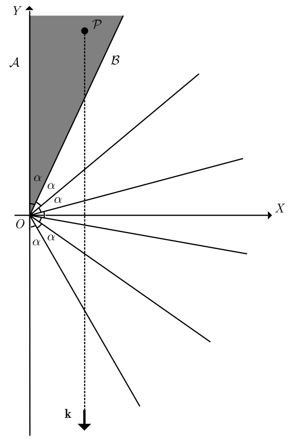

# modmat-billard-pi-problem

<!-- SLIDE 1 -->
## Jogando Sinuca com $\pi$ 

### Como o número de colisões em um sistema mecânico computa os digitos de $\pi$

Leonardo Lima Santos, Lucas Pimentel Alves da Costa, Pedro Kury Kitagawa

<!-- SLIDE 2 -->
## Definição do Problema

### Objetivo: Calcular a quantidade de colisões em um sistema idealizado

- Sistema Físico
    - Parede fixa em $x = 0$
    - Duas bolas de massa $m$ (pequena) e $M$ (grande)
    - Movimento ocorre de forma unidimensional (eixo $X$)
    - A bola $m$ é posicionada em repouso entre a parede e a bola $M$
    - A bola $M$ inicialmente possui velocidade V em direção à bola $m$

<!-- SLIDE 3 -->
## Variáveis e Suposições do Sistema

- Variáveis fundamentais
    - Massa das duas bolas $m$ e $M$
    - A razão entre as massas $\frac{M}{m} = 100^N$. Sendo $N$ o número de digitos de $\pi$ que vamos computar (veremos adiante o porque são 100)

- Simplificações e Variáveis Desprezadas:
    - Colisões perfeitamente elásticas
    - Ausência de atrito e resistência do ar
    - Bolas são partículas adimensionais

<!-- SLIDE 4 -->
## O que realmente acontece nas colisões?

### Análise do caso simples $m = M$

$$
\begin{aligned}
u_0 & = 0 \\
v_0 & = V \\
u_1 & = \frac{(m - M)u_0 + 2Mv_0}{m + M} \\
v_1 & = \frac{(M - m)v_0 + 2mu_0}{m + M} \\
u_1 & = \frac{2MV}{2M} = V \\
v_1 & = \frac {(0)V}{2m}= 0\\
\end{aligned}
$$

1. A bola $M$ bate com velocidade $V$ na bola $m$ e fica em repouso (primeira colisão)
2. A bola $m$ segue até a parede, bate na parede com velocidade $V$ e volta com velocidade $-V$ (segunda colisão)
3. A bola $m$ bate com velocidade $-V$ na bola $M$ e fica em repouso (terceira colisão)
4. A bola $M$ segue indefinidamente com velocidade $-V$

<!-- SLIDE 5 -->
## O espaço de configuração do sistema

- Posição de $m$ como $x(t)$ e $M$ como $y(t)$
- $P(t) = (x(t), y(t))$
- Bola $m$ entre a parede e a bola $M$, significa que $0 \leq x(t) \leq y(t)$
- Colisões
    - Colisões:
        - Bola-Parede
            - $x(t) = 0$ reflexão simples do ponto $P$ no eixo $Y$
        - Bola-Bola
            - $x(t) = y(t)$: reflexão complexa do ponto $P$ na fronteira $x = y$. Não é uma simples reflexão óptica. 

<!-- SLIDE 6 -->
## Início do experimento
$\vec{p} = (x(t),y(t)) = (u,v) $ e $\vec{\dot p} = (\dot x(t),\dot y(t))$ 

<!-- SLIDE 7 -->
## Primeira colisão entre $m$ e $M$
$\vec{\dot p}(0) = (0,V) \vdash \vec{\dot p}(t_1) = (V,0)$

<!-- SLIDE 8 -->
## Colisão entre $m$ e a parede
$\vec{\dot p}(t_1) = (V,0) \vdash \vec{\dot p}(t_2) = (-V,0)$

<!-- SLIDE 9 -->
## Segunda colisão entre $m$ e $M$
$\vec{\dot p}(t_2) = (-V,0) \vdash \vec{\dot p}(t_3) = (0,-V)$

<!-- SLIDE 10 -->
## $M$ segue infinitamente, com $m$ parado.
$\vec{\dot p}(t_{\infty}) = (0,-V)$

<!-- SLIDE 11 -->
## O que acontece quando $m \neq M$?
- As reflexões não são mais ópticas.
- Não sabemos se eventualmente o ponto P volta (ou seja, se as colisões param)

<!-- SLIDE 12 -->
## O pulo do gato

### A chave para simplificar o problema

Tornar a reflexão na fronteira $x = y$ simples

Definimos novas coordenadas $(x', y')$

$$x' = \sqrt{m} \cdot x$$

$$y' = \sqrt{M} \cdot y$$

$$\vec{p} = \begin{pmatrix} x \\ y \end{pmatrix}$$

$$\vec{p'} = \begin{pmatrix} x' \\ y' \end{pmatrix}$$ 

A transformação é uma operação linear que nos leva de $\vec{p}$ para $\vec{p'}$, e por isso pode ser representada por uma matriz de transformação $T$, tal que:
$$\vec{p'} = T \cdot \vec{p}$$

$$T = \begin{pmatrix} \sqrt{m} & 0 \\ 0 & \sqrt{M} \end{pmatrix}$$

Então

$$\vec{p'} = \begin{pmatrix} \sqrt{m} x \\ \sqrt{M} y \end{pmatrix}$$ 

<!-- SLIDE 13 -->
## Novo espaço após aplicação de $T$
Como vamos aplicar a transformação $T$ no espaço inteiro, então o ângulo entre o eixo $X$ e a reta $x=y$ muda.

<!-- SLIDE 14 -->
## Poque aplicamos $T$?

- Nosso objetivo é fazer com que as reflexões sejam reflexões ópticas
- Depois que nossas reflexões forem ópticas, basta refletirmos todo o espaço abaixo do eixo para saber aonde a configuração (nosso ponto $p$) vai parar.

- Precisamos, então, provar que a transformação faz com que as reflexões de $p$ sejam ópticas.

- Se, em qualquer momento que não seja uma reflexão, $\vec{p}$ tem velocidade $\vec{\dot p}= \begin{pmatrix}u \\ v\end{pmatrix}$, então a velocidade de $\vec{p'}$ é $\vec{\dot p'} = \begin{pmatrix} \sqrt{m} \dot x \\ \sqrt{M} \dot y \end{pmatrix} = \begin{pmatrix} \sqrt{m} u \\ \sqrt{M} v \end{pmatrix}$. Então $T$ transforma as velocidades da mesma forma que transforma as posições.

- Vamos analisar o caso em que ocorre a reflexão na parede ($x(t)=0$), e o caso onde ocorre a reflexão no eixo $Y = \sqrt{\frac{M}{m}}X$.

- Obs: Quando aplicamos $T$, o nosso novo ângulo $\alpha$ é tal que $\tan{\alpha}=\frac{\sqrt{m}}{\sqrt{M}}$. Logo $\alpha = \arctan{\sqrt{\frac{m}{M}}}$. Usaremos isso no futuro.

<!-- SLIDE 15 --->
## Reflexão no eixo $Y$

- Quando a bola menor reflete na parede, sua velocidade $u$ passa a ser $(-u)$.
Dessa forma $\vec{\dot p'} = \begin{pmatrix} \sqrt{m}(-u) \\ \sqrt{M}v \end{pmatrix} = \begin{pmatrix} -\sqrt{m}u \\ \sqrt{M}v \end{pmatrix}$

- Isso só acontece quando o ângulo $\varphi$ que a trajetória faz antes de atingir o eixo $Y$ faz com o eixo $Y$ é igual ao ângulo $\psi$ que a trajetória faz depois de atingir o eixo $Y$ com o eixo $Y$.

- Então essa reflexão é óptica. 

$\square 1/2$

<!-- SLIDE 16 --->
## Reflexão no eixo $Y = \sqrt{\frac{M}{m}}X$

- Lembrando: $u$ é a velocidade da bola $m$ e $v$ a velocidade da bola $M$.
- Quando há a colisão entre $m$ e $M$, temos:
$
\begin{aligned}
\begin{cases}
      mu + Mv &= K_1 \\ 
      mu^2 + Mv^2 &= K_2 
\end{cases}
\end{aligned}
$
com $K_1,K_2$ constantes pela conservação do momento linear e da energia cinética.
- Lembrando que $\vec{\dot p'} = \begin{pmatrix} \sqrt{m}u \\ \sqrt{M}v \end{pmatrix}$
- Também vou criar um vetor constante $\vec{m} = \begin{pmatrix} m \\ M\end{pmatrix}$
- Então podemos reescrever como:
$
\begin{aligned}
\begin{cases}
      \vec{m} \cdot \vec{\dot p'} &= K_1 \\ 
      |\vec{\dot p'}|^2 &= K_2 
\end{cases}
\end{aligned}
$
Dessa forma:
$|\vec{m}| |\vec{\dot p'}| \cos{\varphi} = K_1 \therefore$
$(\sqrt{M^2+m^2}) \sqrt{K_2} \cos{\varphi} = K_1 \therefore$
$\cos{\varphi} = \frac{K_1}{(\sqrt{M^2+m^2}) \sqrt{K_2}} = K_3$, com $K_3$ constante.
- Depois da reflexão, o ângulo passa a ser $\psi$, mas o mesmo sistema ainda vale, então $\cos{\psi} = K_3$
- Dessa forma $\psi = \varphi$

$\blacksquare 2/2$

<!-- SLIDE 17 -->
## Número de Reflexões Ópticas

- Pelo que sabemos até agora, o número de reflexões ópticas poderia ser infinito. Precisamos demonstrar que esse número é finito.

Enunciamos, e vamos provar em seguida, o seguinte teorema:

- <b>Lema:</b>

    - <b>(a)</b> O número máximo de reflexões do ponto de bilhar dentro de um ângulo $\alpha$, considerando todas as trajetórias possíveis, é finito.

    - <b>(b)</b> Esse número é igual a $\frac{\pi}{\alpha}$ quando $\frac{\pi}{\alpha} \in \mathbb{Z}$, e igual a $[\frac{\pi}{\alpha}]+1$ do contrário.

    - <b>(c)</b> Se o raio inicial for paralelo a um dos lados do ângulo $\alpha$, então o número total de reflexões nessa trajetória é um menos do que o máximo. ou seja, $\frac{\pi}{\alpha}-1$ quando $\frac{\pi}{\alpha} \in \mathbb{Z}$, e igual a $[\frac{\pi}{\alpha}]$ do contrário.

Obs: Vamos provar apenas o caso em que é paralelo, pois é o único caso que usaremos

Vamos "desdobrar" o ângulo $\alpha$ juntamente com a trajetória de bilhar $\gamma$. A Imagem da trajetória $\gamma$ é $k$, e já que as reflexões são ópticas, ela faz uma linha reta

<!-- SLIDE 18 --> 
## Prova do Lema anterior

- A linha $k$ intersecta uma quantidade finita de cópias do ângulo $\alpha$, e esse número de intersecções coincide com o número de reflexões de $\gamma$ dentro do ângulo $\alpha$. Então o número de intersecções é finito. $\square 1/3$
- Se $n$ é o número máximo de reflexões, temos $n\alpha=\pi$, ou $n\alpha >\pi>(n-1)\alpha$. No primeiro caso, $n = \frac{\pi}{\alpha}$, no segundo caso, $n = [\frac{\pi}{\alpha}]+1$. $\square 2/3$ 
- Quando $k$ é paralelo ao lado do ângulo $\alpha$, então a possível intersecção final não acontece. $\blacksquare 3/3$

<!-- SLIDE 19 -->

## Prova do teorema $\Pi=31415926535897\dots$

Com todas as ferramentas que criamos, podemos, agora, analisar a excepcionalidade do sistema "parede-bola-bola". Tome o número de reflexões $\Pi(N)$. Suponha, novamente, o raio $k$ que descreve o desdobramento da trajetória $\gamma$ do sistema na configuração $\alpha = AOB$. O início de $\gamma$ (i.e., antes do primeiro choque) deve ser paralelo ao eixo $Y$, assim como $k$.

Dessa maneira, pelo Lema (C), o número de reflexões nos "lados do ângulo $\alpha$" é igual a $[\pi/\alpha]$, caso $\pi/\alpha$ não seja um inteiro. Nesse caso:

$$
\alpha = \arctan{\sqrt{\frac{m}{M}}} = \arctan{\sqrt{\frac{m}{m \cdot 100^N}}} = \arctan{(10^{-N})}
$$

Repare que, para $N=0$:

$$
\alpha = \arctan (1) \implies \alpha = \frac{\pi}{4} \newline \frac{\pi}{\alpha} = 4
$$

Então a primeira parte do Lema (c) vale: 

$$
\Pi(0)=[4] - 1 = 3
$$ 

Entretanto, para $N\ge1$, $\alpha = \arctan(10^{-N})$ não é um ângulo do tipo $\pi/c$ com $c\ge1$ tal que $c\in\mathbb{N}$. Portanto, é um ângulo arbitrário que não consegue mensurar um número racional de graus $(180/k)\degree$. Nesse contexto, a segunda parte do Lema (C) é aplicável e consequentemente achamos a fórmula exata:

$$
\Pi(N) = \left[\frac{\pi}{\arctan(10^{-N})}\right]
$$

<!-- 
proof roadmap
k começa sempre paralelo ao eixo y pois, por hipotese, a bola m começa em repouso

de acordo com o lema 2 (c), o numero de reflexoes para o angulo $\alpha$ é $\frac{\pi}{\alpha}, a menos que isso seja um inteiro, mas no nosso caso:

-->

$$
\arctan{x} = \int^x_0{\frac{dt}{1+t^2}} = \int^x_0 \sum^{\infty}_{n=0}(-t^2)^ndt = \sum^{\infty}_{n=0}\frac{(-1)^nx^{2n+1}}{2n+1}
$$

$$
\arctan{x} = x - \frac{x^3}{3} + \frac{x^5}{5} - \frac{x^7}{7} + \dots
$$

    
 logo, 

<!-- Referência -->
## Referências
1. GALPERIN, G. PLAYING POOL WITH π (THE NUMBER π FROM A BILLIARD POINT OF VIEW). 9 dez. 2003.
2. 3BLUE1BROWN. The most unexpected answer to a counting puzzle. YouTube, 13 jan. 2019. Disponível em: <https://youtu.be/HEfHFsfGXjs>. Acesso em: 21 jun. 2025.
3. 3BLUE1BROWN. There’s more to those colliding blocks that compute pi. YouTube, 13 mar. 2025. Disponível em: <https://youtu.be/6dTyOl1fmDo>. Acesso em: 21 jun. 2025.
4. STAND-UP MATHS. We calculated pi with colliding blocks. Youtube, 13 mar. 2025. Disponível em: <https://youtu.be/vlUTlbZT4ig>. Acesso em: 21 jun. 2025.