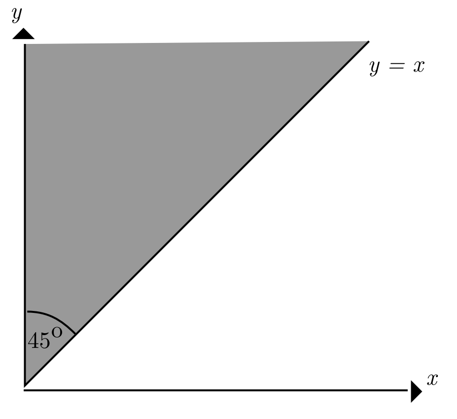
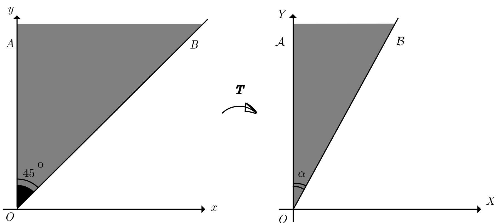
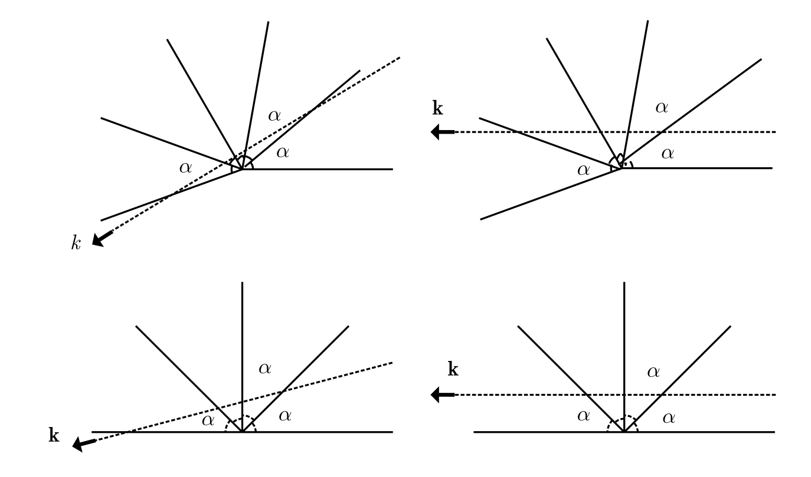

# modmat-billard-pi-problem

<!-- SLIDE 1 -->
## Jogando Sinuca com π 

### Como o número de colisões em um sistema mecânico computa os dígitos de π

Leonardo Lima Santos, Lucas Pimentel Alves da Costa, Pedro Kury Kitagawa

<!-- SLIDE 2 -->
## Definição do Problema

### Objetivo: Calcular a quantidade de colisões em um sistema idealizado

- Sistema Físico
    - Parede fixa em $x = 0$
    - Duas bolas de massa $m$ (pequena) e $M$ (grande)
    - Movimento ocorre de forma unidimensional (eixo $X$)
    - A bola $m$ é posicionada em repouso entre a parede e a bola $M$
    - A bola $M$ inicialmente possui velocidade V em direção à bola $m$

<!-- SLIDE 3 -->
## Variáveis e Suposições do Sistema

- Variáveis fundamentais
    - Massa das duas bolas $m$ e $M$
    - A razão entre as massas $\frac{M}{m} = 100^N$. Sendo $N$ o número de dígitos de $π$ que vamos computar

- Simplificações e Variáveis Desprezadas:
    - Colisões perfeitamente elásticas
    - Ausência de atrito e resistência do ar
    - Bolas são partículas adimensionais

<!-- SLIDE 4 -->
## Análise do Caso Simples: $m = M$

### Equações de colisão elástica

$$
\begin{aligned}
u_0 & = 0, \quad v_0 = V \\
u_1 & = \frac{(m - M)u_0 + 2Mv_0}{m + M} \\
v_1 & = \frac{(M - m)v_0 + 2mu_0}{m + M}
\end{aligned}
$$

Para $m = M$:
$$
\begin{aligned}
u_1 & = \frac{2MV}{2M} = V \\
v_1 & = \frac{(0)V}{2m} = 0
\end{aligned}
$$

<!-- SLIDE 5 -->
## Sequência de Colisões para $m = M$

1. A bola $M$ bate com velocidade $V$ na bola $m$ e fica em repouso (primeira colisão)
2. A bola $m$ segue até a parede, bate na parede com velocidade $V$ e volta com velocidade $-V$ (segunda colisão)
3. A bola $m$ bate com velocidade $-V$ na bola $M$ e fica em repouso (terceira colisão)
4. A bola $M$ segue indefinidamente com velocidade $-V$

**Total: 3 colisões**

<!-- SLIDE 6 -->
## O Espaço de Configuração do Sistema

- Posição de $m$ como $x(t)$ e $M$ como $y(t)$
- $P(t) = (x(t), y(t))$
- Restrição física: $0 \leq x(t) \leq y(t)$ (bola $m$ entre a parede e a bola $M$)

### Tipos de Colisões:
- **Bola-Parede**: $x(t) = 0$ → reflexão simples do ponto $P$ no eixo $Y$
- **Bola-Bola**: $x(t) = y(t)$ → reflexão complexa do ponto $P$ na fronteira $x = y$

<!-- SLIDE 7 -->
## Visualização: Início do Experimento
$\vec{p} = (x(t),y(t)) = (u,v)$ e $\vec{\dot{p}} = (\dot{x}(t),\dot{y}(t))$ 

<!-- SLIDE 8 -->
## Visualização: Primeira Colisão entre $m$ e $M$
$\vec{\dot{p}}(0) = (0,V) \vdash \vec{\dot{p}}(t_1) = (V,0)$

<!-- SLIDE 9 -->
## Visualização: Colisão entre $m$ e a Parede
$\vec{\dot{p}}(t_1) = (V,0) \vdash \vec{\dot{p}}(t_2) = (-V,0)$

<!-- SLIDE 10 -->
## Visualização: Segunda Colisão entre $m$ e $M$
$\vec{\dot{p}}(t_2) = (-V,0) \vdash \vec{\dot{p}}(t_3) = (0,-V)$

<!-- SLIDE 11 -->
## Visualização: Estado Final
$\vec{\dot{p}}(t_{\infty}) = (0,-V)$ - $M$ segue infinitamente, com $m$ parado

<!-- SLIDE 12 -->
## O Problema para $m \neq M$

- As reflexões não são mais ópticas
- Não sabemos se eventualmente o ponto P para (se as colisões cessam)
- Precisamos de uma nova abordagem matemática

<!-- SLIDE 13 -->
## A Transformação Fundamental

### O pulo do gato: Tornar as reflexões ópticas

Definimos novas coordenadas $(x', y')$:

$$x' = \sqrt{m} \cdot x \quad \text{e} \quad y' = \sqrt{M} \cdot y$$

$$\vec{p'} = T \cdot \vec{p} \quad \text{onde} \quad T = \begin{pmatrix} \sqrt{m} & 0 \\ 0 & \sqrt{M} \end{pmatrix}$$

Resultado:
$$\vec{p'} = \begin{pmatrix} \sqrt{m} x \\ \sqrt{M} y \end{pmatrix}$$

<!-- SLIDE 14 -->
## Novo Espaço de Configuração

Como aplicamos a transformação $T$ no espaço inteiro, o ângulo entre o eixo $X$ e a reta $x=y$ muda.

**Novo ângulo**: $\alpha = \arctan\sqrt{\frac{m}{M}}$

<!-- SLIDE 15 -->
## Por que a Transformação Funciona?

### Propriedades da transformação $T$:

- $T$ transforma velocidades da mesma forma que transforma posições
- Se $\vec{\dot{p}} = \begin{pmatrix}u \\ v\end{pmatrix}$, então $\vec{\dot{p'}} = \begin{pmatrix} \sqrt{m} u \\ \sqrt{M} v \end{pmatrix}$

### Objetivo:
Provar que as reflexões se tornam ópticas após aplicar $T$

<!-- SLIDE 16 -->
## Prova: Reflexão no Eixo Y é Óptica

Quando a bola menor reflete na parede:
- Velocidade $u$ passa a ser $(-u)$
- $\vec{\dot{p'}} = \begin{pmatrix} -\sqrt{m}u \\ \sqrt{M}v \end{pmatrix}$

**Condição óptica**: ângulo de incidência $\varphi$ = ângulo de reflexão $\psi$ ✓

$\square$ **1/2**

<!-- SLIDE 17 -->
## Prova: Reflexão na Diagonal é Óptica

### Conservação nas colisões bola-bola:
$$
\begin{cases}
mu + Mv = K_1 & \text{(momento linear)} \\ 
mu^2 + Mv^2 = K_2 & \text{(energia cinética)}
\end{cases}
$$

### Em coordenadas transformadas:
Com $\vec{m} = \begin{pmatrix} \sqrt{m} \\ \sqrt{M}\end{pmatrix}$ e $\vec{\dot{p'}} = \begin{pmatrix} \sqrt{m}u \\ \sqrt{M}v \end{pmatrix}$:

$$
\begin{cases}
\vec{m} \cdot \vec{\dot{p'}} = K_1 \\
|\vec{\dot{p'}}|^2 = K_2
\end{cases}
$$

<!-- SLIDE 18 -->
## Conclusão da Prova de Reflexão Óptica

$$|\vec{m}| |\vec{\dot{p'}}| \cos{\varphi} = K_1$$

$$\cos{\varphi} = \frac{K_1}{(\sqrt{M^2+m^2}) \sqrt{K_2}} = K_3 \text{ (constante)}$$

Após a reflexão, o mesmo sistema vale, então $\cos{\psi} = K_3$

Portanto: $\psi = \varphi$ ✓

$\blacksquare$ **2/2**

<!-- SLIDE 19 -->
## Lema: Número Finito de Reflexões

**Teorema Principal:**

**(a)** O número máximo de reflexões do ponto de bilhar dentro de um ângulo $\alpha$ é finito

**(b)** Esse número é $\frac{\pi}{\alpha}$ quando $\frac{\pi}{\alpha} \in \mathbb{Z}$, e $\left[\frac{\pi}{\alpha}\right]+1$ caso contrário

**(c)** Se o raio inicial for paralelo a um dos lados do ângulo $\alpha$, então o número total de reflexões é $\frac{\pi}{\alpha}-1$ quando $\frac{\pi}{\alpha} \in \mathbb{Z}$, e $\left[\frac{\pi}{\alpha}\right]$ caso contrário

<!-- SLIDE 20 -->
## Prova do Lema: Método do Desdobramento

"Desdobramos" o ângulo $\alpha$ juntamente com a trajetória de bilhar $\gamma$. A imagem da trajetória $\gamma$ é a linha reta $k$.

**Observações:**
- Reflexões ópticas → trajetória retilínea no espaço desdobrado
- Número finito de intersecções da linha $k$ com cópias do ângulo $\alpha$

<!-- SLIDE 21 -->
## Demonstração das Partes do Lema

**(a)** A linha $k$ intersecta uma quantidade finita de cópias do ângulo $\alpha$, coincidindo com o número de reflexões de $\gamma$. $\square$ **1/3**

**(b)** Se $n$ é o número máximo de reflexões:
- $n\alpha = \pi$ → $n = \frac{\pi}{\alpha}$
- $n\alpha > \pi > (n-1)\alpha$ → $n = \left[\frac{\pi}{\alpha}\right]+1$ $\square$ **2/3**

**(c)** Quando $k$ é paralelo ao lado do ângulo $\alpha$, a possível intersecção final não acontece. $\blacksquare$ **3/3**

<!-- SLIDE 22 -->
## Aplicação: Calculando $\Pi(N)$

### Fórmula principal:
$$\Pi(N) = \left[\frac{\pi}{\alpha}\right] \text{ onde } \alpha = \arctan\sqrt{\frac{m}{M}}$$

### Substituindo a razão de massas:
$$\alpha = \arctan\sqrt{\frac{m}{m \cdot 100^N}} = \arctan(10^{-N})$$

**Fórmula exata:**
$$\Pi(N) = \left[\frac{\pi}{\arctan(10^{-N})}\right]$$

<!-- SLIDE 23 -->
## Caso Simples: $N = 0$

Para $N = 0$:
$$\alpha = \arctan(10^0) = \arctan(1) = \frac{\pi}{4}$$

Aplicando o Lema (c):
$$\Pi(0) = \left[\frac{\pi}{\pi/4}\right] = [4] = 3$$

**Confirmação**: Este resultado coincide com nossa análise inicial!

<!-- SLIDE 24 -->
## Casos Gerais: $N \geq 1$

Para $N \geq 1$, $\alpha = \arctan(10^{-N})$ não é facilmente calculável.

**Aproximação usando série de Taylor:**
$$\arctan{x} = x - \frac{x^3}{3} + \frac{x^5}{5} - \frac{x^7}{7} + \dots$$

Para $x = 10^{-N}$ (pequeno), $\arctan{x} \approx x$

$$\lim_{x \to 0}\left( \frac{1}{\arctan{x}} - \frac{1}{x} \right) = 0$$

<!-- SLIDE 25 -->
## Aproximação Final

Como $\frac{1}{\arctan{x}} > \frac{1}{x}$ para $x > 0$:

$$\Pi(N) = \left[\frac{\pi}{\arctan(10^{-N})}\right] \approx \left[\frac{\pi}{10^{-N}}\right] = \left[\pi \cdot 10^{N}\right]$$

**Resultado surpreendente:**
$$\Pi(N) \approx \pi \cdot 10^{N}$$

A aproximação é uma igualdade para $0 < N < 50.000.000$ (comprovado empiricamente).

<!-- SLIDE 26 -->
## Análise do Erro Máximo

$$\lim_{N \to \infty} \left(\frac{\pi}{\arctan{10^{-N}}} - \frac{\pi}{10^{-N}} \right) = 0$$

### Duas possibilidades para $N$ grande:

**Opção 1:** $\Pi(N) = [\pi \cdot 10^N] = 31415\dots a_{N-1}a_N$
- Método computa os $N$ primeiros dígitos corretamente

**Opção 2:** $\Pi(N) = [\pi \cdot 10^N] + 1 = 31415\dots a_{N-1}a_N + 1$
- Método falha apenas no último dígito, e somente em 1 unidade

<!-- SLIDE 27 -->
## Referências

1. GALPERIN, G. PLAYING POOL WITH π (THE NUMBER π FROM A BILLIARD POINT OF VIEW). 9 dez. 2003.

2. 3BLUE1BROWN. The most unexpected answer to a counting puzzle. YouTube, 13 jan. 2019. Disponível em: <https://youtu.be/HEfHFsfGXjs>. Acesso em: 19 jun. 2025.

3. 3BLUE1BROWN. There's more to those colliding blocks that compute pi. YouTube, 13 mar. 2025. Disponível em: <https://youtu.be/6dTyOl1fmDo>. Acesso em: 19 jun. 2025.

4. STAND-UP MATHS. We calculated pi with colliding blocks. Youtube, 13 mar. 2025. Disponível em: <https://youtu.be/vlUTlbZT4ig>. Acesso em: 19 jun. 2025.